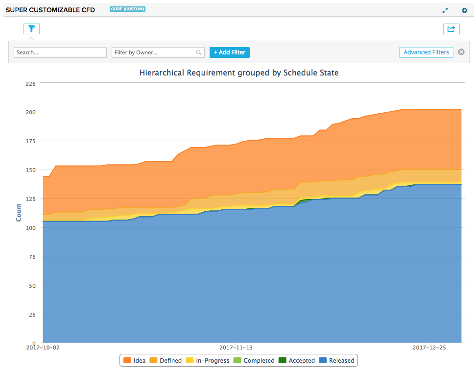
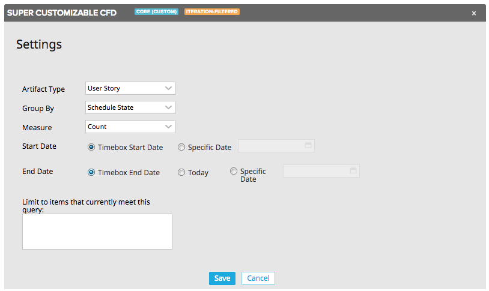

# Super Customizable Cumulative Flow Diagram

A super-customizable cumulative flow diagram, aka a CFD, for Rally.

**Note: This cannot be used in on-premises installations.**

## Installation and Settings

The app is installed as a Custom HTML App ([see help documentation](https://help.rallydev.com/custom-html))
Once the app is installed, use the gear menu on the app panel and select "Edit App Settings".

#### Artifact Type
Pick the type of data to include in the chart- Defect for example.

#### Group By
Pick the attribute on the previously selected type which will be used for generating the summary data for the chart.

#### Measure
Pick how the summary should be performed- for example, a simple count, or a sum of the Plan Estimates.

#### Start Date
Choose the starting date for the chart.  If the app is used on a timebox (iteration/release) scoped custom page you can choose to automatically use that timebox's start date.  You may also choose a specific date.

#### End Date
Choose the ending date for the chart.  If the app is used on a timebox (iteration/release/milestone) scoped custom page you can choose to automatically use that timebox's end date.  You may also choose 'Today' or a specific date.

#### Query
In addition to the advanced filtering component in the app, you can write your own complex filter queries. [Extensive documentation](https://help.rallydev.com/grid-queries?basehost=https://rally1.rallydev.com) is available. This might be useful if you want to always limit the chart to certain complex criteria.

## Development Notes

Jan 2018
 * Update to sdk 2.1
 * Move to using rally app builder rather than grunt 
 * Add export
 * Add advanced filtering
 * Add support for timebox scoped pages
 * Add support for end date of today
 
10 August 2014 - This is a complete rewrite.  The most significant changes are:
 * Settings are now accessed from the gear menu
 * The chart now uses the Luminize calculator to analyze snapshots
 * Grouping on fields with allowed values that include booleans or no selection now display series correctly
 * App uses rc3 SDK

 ### TODO
 * Perhaps an additional filter for the lookback itself (that is, apply the limits every day instead of (in addition to?) at the end and retconning)
 * Add query math for date keywords

### Development

Use [Rally App Builder](https://github.com/Rallyapps/rally-app-builder) to develop/build/run this app.

### Testing

Use grunt to test this app.

If you've just downloaded this from github and you want to do development,
you're going to need to have these installed:

 * git
 * node.js
 * grunt-cli
 * grunt-init

If you have those three installed, just type this in the root directory here
to get set up to develop:

  npm install

### Structure

  * src/javascript:  All the JS files saved here will be compiled into the
  target html file
  * src/style: All of the stylesheets saved here will be compiled into the
  target html file
  * test/fast: Fast jasmine tests go here.  There should also be a helper
  file that is loaded first for creating mocks and doing other shortcuts
  (fastHelper.js) **Tests should be in a file named <something>-spec.js**
  * test/slow: Slow jasmine tests go here.  There should also be a helper
  file that is loaded first for creating mocks and doing other shortcuts
  (slowHelper.js) **Tests should be in a file named <something>-spec.js**
  * templates: This is where templates that are used to create the production
  and debug html files live.  The advantage of using these templates is that
  you can configure the behavior of the html around the JS.
  * config.json: This file contains the configuration settings necessary to
  create the debug and production html files.  Server is only used for debug,
  name, className and sdk are used for both.
  * package.json: This file lists the dependencies for grunt
  * auth.json: This file should NOT be checked in.  Create this to run the
  slow test specs.  It should look like:
    {
        "username":"you@company.com",
        "password":"secret"
    }

### Usage of the grunt file
#### Tasks

##### grunt debug

Use grunt debug to create the debug html file.  You only need to run this when you have added new files to
the src directories.

##### grunt build

Use grunt build to create the production html file.  We still have to copy the html file to a panel to test.

##### grunt test-fast

Use grunt test-fast to run the Jasmine tests in the fast directory.  Typically, the tests in the fast
directory are more pure unit tests and do not need to connect to Rally.

##### grunt test-slow

Use grunt test-slow to run the Jasmine tests in the slow directory.  Typically, the tests in the slow
directory are more like integration tests in that they require connecting to Rally and interacting with
data.
